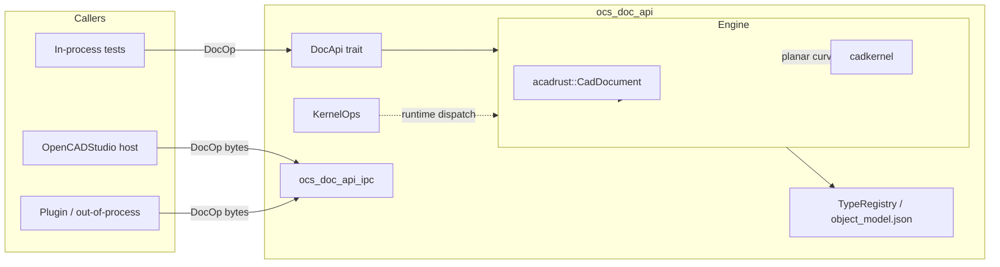
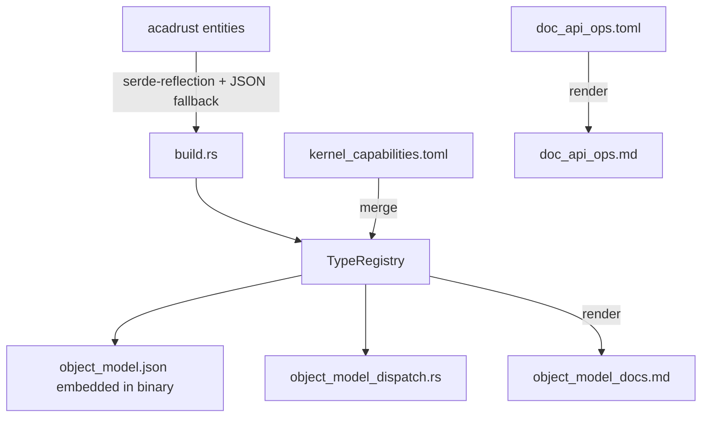

# ocs_doc_api

Stable object model and transport-agnostic document API for the OpenCADStudio drawing kernel.

## Purpose

`ocs_doc_api` sits between the CAD file format (`acadrust`) and the geometry kernel (`cadkernel`). It exposes a small, version-stable API for creating, reading, updating, and deleting entities in a drawing document, plus a small set of geometry operations such as offsetting polylines.

The crate is intentionally independent from `ocs_plugin_api`. The core crate can be used without any plugin system, and an optional `ocs_doc_api_ipc` subcrate provides a callback-based local client for out-of-process callers.

## Architecture overview



## Features

| Feature | What it enables |
|---|---|
| (none) | Object-model JSON, parsed `TypeRegistry`, embedded Markdown docs, `validate_entity_payload`. |
| `kernel` | `KernelOps` trait and generated geometry dispatch via `acadrust` + `cadkernel`. |
| `engine` | `DocApi`, `InProcessDocApi`, and typed convenience methods. |

## Quick start

```rust
use ocs_doc_api::{
    doc_api::{DocApiExt, EntityPayload},
    in_process::InProcessDocApi,
};

let mut api = InProcessDocApi::new("drawing");
let receipt = api.create_entity(EntityPayload::new(
    "line",
    serde_json::json!({
        "common": { "handle": 0, "layer": "0" },
        "start": { "x": 0.0, "y": 0.0, "z": 0.0 },
        "end": { "x": 10.0, "y": 0.0, "z": 0.0 },
        "thickness": 0.0,
        "normal": { "x": 0.0, "y": 0.0, "z": 1.0 }
    }),
)).unwrap();
```

See the `examples/` directory for more patterns.

## Supported entity types

The generated object model covers all first-level `acadrust::entities::EntityType` variants, including primitives (`Point`, `Line`, `Circle`, `Arc`, `Ellipse`), polylines (`Polyline`, `Polyline2D`, `Polyline3D`, `LwPolyline`), annotations (`Text`, `MText`, `Dimension`, `Tolerance`, `Leader`, `MultiLeader`), complex objects (`Hatch`, `Solid`, `Face3D`, `Solid3D`, `Surface`, `Region`, `Body`, `Mesh`, `Table`, `Underlay`, `RasterImage`, `Wipeout`), and many more. See `doc/object_model_docs.md` for the full list and field shapes.

### Kernel capabilities

The first milestone exposes these geometry operations:

- `to_planar_curve`: `Line`, `Circle`, `Arc`, `Ellipse`, `Spline`, `Polyline`, `Polyline2D`, `Polyline3D`, `LwPolyline`, `Ray`, `XLine`
- `offset`: `LwPolyline`

`Helix` is listed with `to_planar_curve` but deliberately returns `None` because a helix has no faithful planar projection. See `kernel_capabilities.toml` for the full capability table.

## Generated artifacts

The build script produces:

- `object_model.json` — embedded compact JSON describing every entity type.
- `object_model_docs.md` — Markdown documentation for the object model.
- `doc_api_ops.md` — Markdown documentation for `DocOp` variants.
- `object_model_dispatch.rs` — build-time capability map included under the `kernel` feature.



Run the `generate_docs` binary to write the Markdown files to a directory:

```bash
cargo run -p ocs_doc_api --bin generate_docs -- --out-dir docs/
```

## Crate layout

```text
crates/ocs_doc_api/
├── Cargo.toml
├── build.rs
├── kernel_capabilities.toml
├── doc_api_ops.toml
├── README.md
├── doc/
│   ├── ARCHITECTURE.md
│   ├── IMPLEMENTATION.md
│   ├── object_model_docs.md
│   └── doc_api_ops.md
├── src/
│   ├── lib.rs
│   ├── schema.rs
│   ├── doc_api.rs
│   ├── in_process.rs
│   ├── convert.rs
│   ├── kernel_ops.rs
│   └── bin/generate_docs.rs
├── ocs_doc_api_ipc/
│   └── src/lib.rs
└── examples/
```

## License

Licensed under the same terms as the OpenCADStudio workspace.
