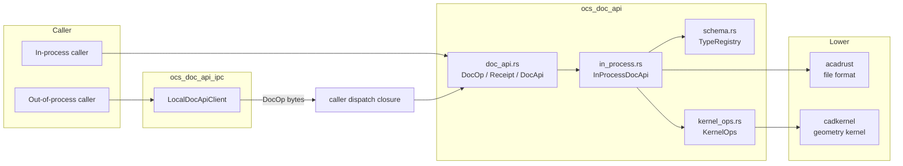
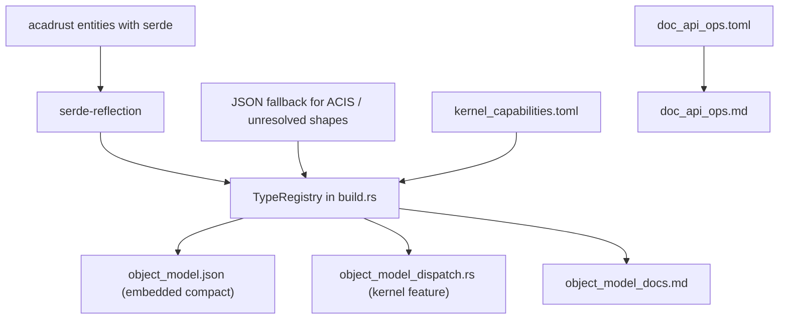

# ocs_doc_api Architecture

This document describes the high-level architecture of `ocs_doc_api` and how it relates to the rest of the OpenCADStudio workspace.

## Goals

1. Provide a stable, language-agnostic object model for all first-level `acadrust::entities::EntityType` variants.
2. Expose a transport-agnostic runtime API (`DocApi`) that can run in-process or over IPC.
3. Keep the core crate free of `ocs_plugin_api` so it can be used by the kernel, the host, and plugins alike.
4. Generate human-readable API documentation from the same source of truth as the code.
5. Declare kernel capabilities in one hand-written file and merge them into the generated object model at build time.

## Layers

## Core components

### `schema`

The `schema` module defines the public object-model types:

- `TypeRegistry` — the complete set of traced types.
- `TypeInfo` — metadata for one type: kind, fields, enum variants, capabilities.
- `Capability` — a kernel operation attached to an entity type.

The registry is generated at build time by `build.rs` and embedded as JSON. At runtime it is deserialized with `serde_json`.

### `doc_api`

The public operation API:

- `DocOp` — one document operation (CRUD, snapshot, offset, etc.).
- `Receipt` — the result of one `DocOp`.
- `DocApi` trait — `execute(&mut self, op) -> Result<Receipt, DocApiError>`.
- `DocApiExt` — typed convenience methods built on top of `DocApi`.
- `EntityPayload` — serializable entity representation using `serde_json::Value`.
- `validate_entity_payload` — checks an entity payload against the generated registry, rejects unknown fields, and performs shallow type checking of supplied field values.

### `in_process`

`InProcessDocApi` wraps `acadrust::CadDocument` and implements `DocApi`. It handles entity lifecycle and delegates geometry operations to `KernelOps`.

### `kernel_ops`

`KernelOps` is a trait that maps `acadrust` entity types to `cadkernel` geometry operations. Capabilities are declared in `kernel_capabilities.toml` and merged into the object model at build time. First-milestone capabilities:

- `to_planar_curve`: `Line`, `Circle`, `Arc`, `Ellipse`, `Spline`, `Polyline`, `Polyline2D`, `Polyline3D`, `LwPolyline`, `Ray`, `XLine`
- `offset`: `LwPolyline`

`Helix` is listed for `to_planar_curve` but deliberately returns `None` because a helix has no faithful planar projection. All `to_planar_curve` implementations currently require the entity extrusion normal to be the world +Z axis; other orientations return `None`.

### `ocs_doc_api_ipc`

The optional IPC subcrate provides `LocalDocApiClient`, a callback-based `DocApi` implementation. The caller supplies a dispatch closure; the subcrate encodes/decodes operations as JSON bytes. This avoids a dependency on `ocs_plugin_api` in the first milestone.

## Build pipeline

`kernel_capabilities.toml` is merged into the registry at build time.

`build.rs` first tries to trace the `acadrust` object model with `serde-reflection`. For entity shapes that `serde-reflection` cannot finish (recursive ACIS data in `Solid3D`/`Region`/`Body`/`Surface`, unresolved optional boxes, etc.), it derives a registry entry from the entity's JSON serialization. This guarantees that every first-level `EntityType` variant has a shape entry while keeping the crate compiling and tests passing.

## Feature flags

| Feature | Enables | Dependencies |
|---|---|---|
| (none) | Object model, parsed `TypeRegistry`, embedded Markdown docs, `validate_entity_payload` | `serde`, `serde_json` |
| `kernel` | `KernelOps` trait and generated geometry dispatch | `acadrust`, `cadkernel` |
| `engine` | `DocApi`, `InProcessDocApi`, `DocApiExt` | `kernel` |

## Future extensions

- Proc-macro capability discovery in `cadkernel`.
- Real `ocs_plugin_api` IPC with dedicated request/response variants.
- Typed payload builders generated from the registry.
- Language bindings generated from `object_model.json`.
