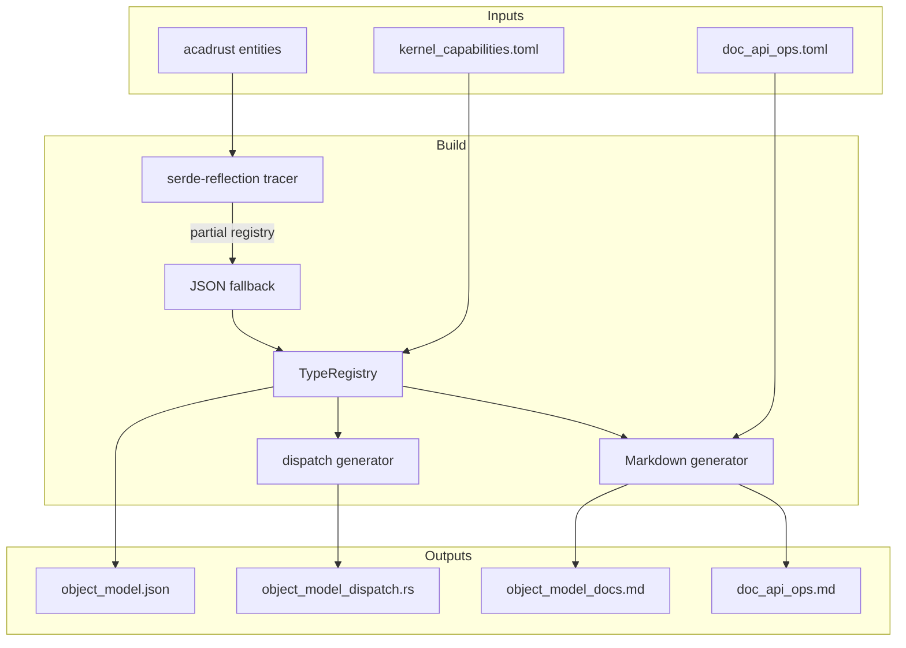
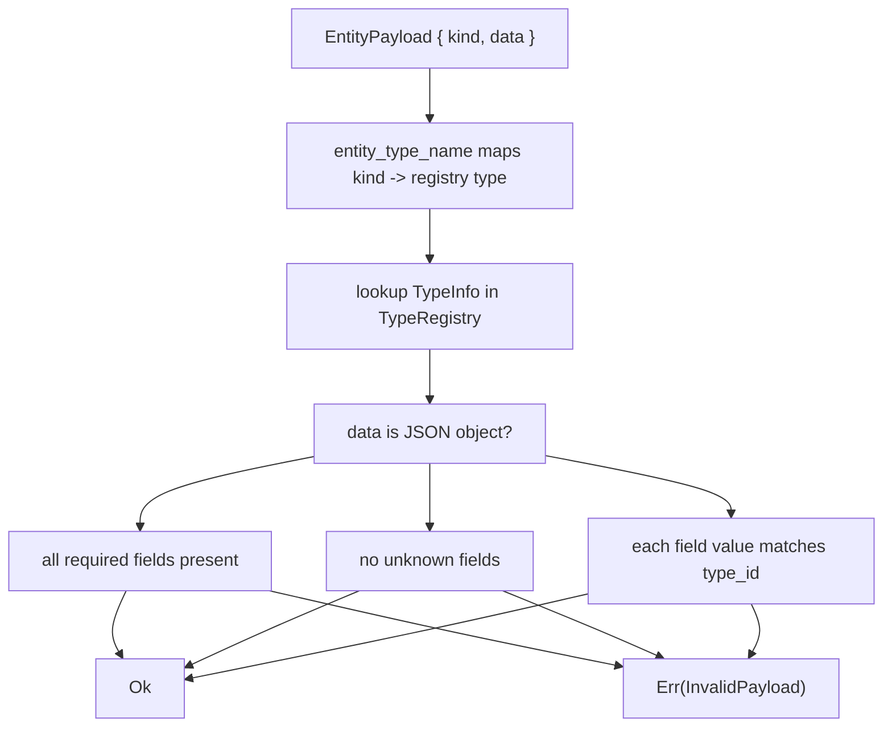
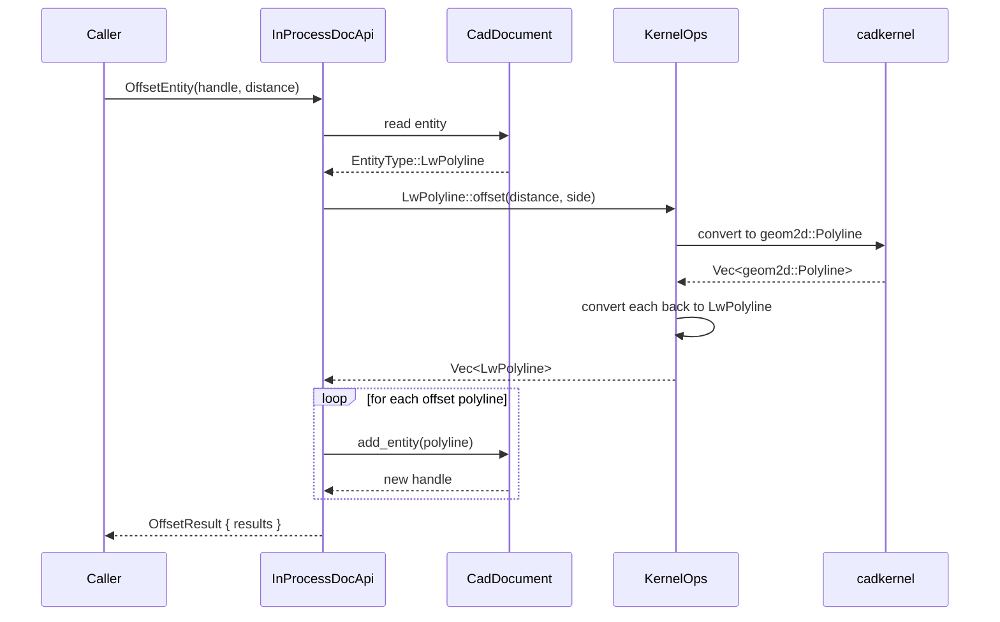
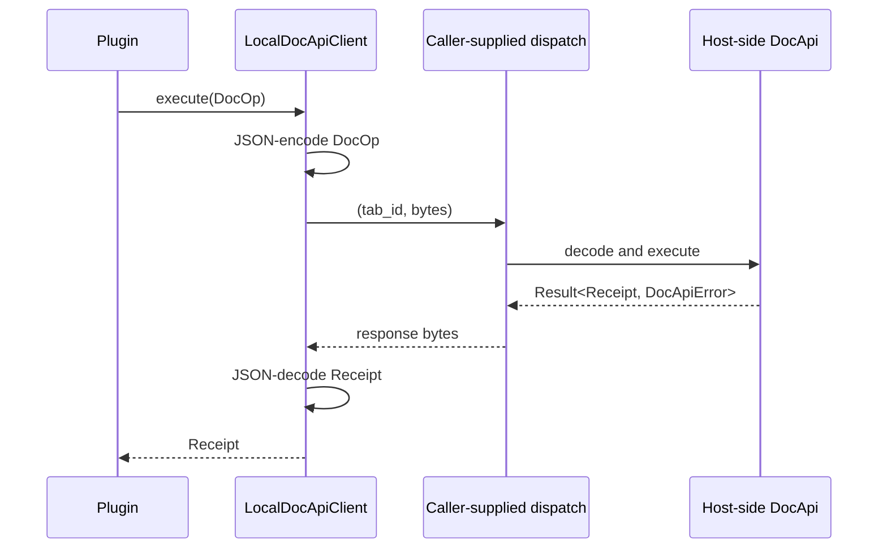

# ocs_doc_api Implementation Notes

This document describes how the crate is implemented and where to find specific pieces of logic.

## Build-time code generation

### `build.rs`

`build.rs` is responsible for producing the artifacts that `src/lib.rs` embeds:

1. Trace selected `acadrust` roots with `serde-reflection`.
2. Map the `serde-reflection::Registry` into the local `schema::TypeRegistry`.
3. Back-fill any entity shape that `serde-reflection` cannot finish from JSON.
4. Load `kernel_capabilities.toml` and merge capabilities into the registry.
5. Generate Markdown docs from the registry and `doc_api_ops.toml`.
6. Write `object_model.json`, `object_model_dispatch.rs`, and the Markdown files to `OUT_DIR`.

Because `build.rs` cannot depend on the crate it is building, it includes `src/schema.rs` directly via `#[path = "src/schema.rs"] mod schema;`. This guarantees the generated JSON matches the runtime schema exactly.



### Tracing strategy

The build script registers a sample for every first-level `EntityType` variant. Because `serde-reflection` needs concrete samples for non-unit enum variants, the sample is serialized through `tracer.trace_value`.

The trace intentionally omits document-level roots (`CadDocument`, `HeaderVariables`, `ObjectType`) because they pull in the generic symbol table `Table<T>`, whose short name collides with the entity `Table`. It also omits `Solid3D`, `Region`, `Body`, and `Surface` because their recursive `AcisData` (`Option<Box<AcisData>>`) cannot be resolved by `serde-reflection`.

After tracing, `build.rs` back-fills any missing entity shape from the JSON serialization produced by `src/entity_samples.rs::all()`. This guarantees that every first-level `EntityType` variant has a registry entry. JSON-derived entries contain top-level field names and coarse type IDs (`Object`, `f64`, `String`, `bool`, `Array`), which is sufficient for `validate_entity_payload`. Fields in these entries are marked optional by default because the sample is used for shape discovery, not requiredness; a small set of well-known required fields (e.g. `Line.start`, `Line.end`) is promoted afterward so payload validation can reject incomplete payloads.

### Capability merge

`kernel_capabilities.toml` contains entries like:

```toml
[[capability]]
entity = "Line"
name = "to_planar_curve"
output = "Option<cadkernel::space::PlanarCurve>"
```

The first milestone declares `to_planar_curve` for `Line`, `Circle`, `Arc`, `Ellipse`, `Spline`, `Polyline`, `Polyline2D`, `Polyline3D`, `LwPolyline`, `Ray`, and `XLine`, plus `offset` for `LwPolyline`. `Helix` is also listed for `to_planar_curve` but the implementation deliberately returns `None` because a helix has no planar projection.

The build script validates that the entity string exists in the registry and attaches the capability to that type. Because the JSON-derived fallback runs before the capability merge, every declared entity is guaranteed to be present.

## Runtime implementation

### `src/schema.rs`

Defines the public schema types. `TypeRegistry` is deserialized from the embedded `object_model.json`.

### `src/doc_api.rs`

- `DocOp` and `Receipt` are internally tagged enums so JSON payloads are self-describing.
- `Handle` is defined in `src/lib.rs` and re-used here.
- `entity_type_name` maps canonical lowercase kinds (e.g. `lwpolyline`) to registry type names (e.g. `LwPolyline`) via a lazily-initialized static map.
- `validate_entity_payload` checks that a payload's `kind` maps to a known struct type, rejects unknown fields, verifies that each supplied field's JSON shape matches the declared type, and allows optional fields to be `null`.
- `entity_to_payload` serializes an `acadrust::EntityType` and splits the externally tagged wrapper into `kind` + `data`.



### `src/in_process.rs`

`InProcessDocApi` stores:

- `doc: CadDocument`
- `name: String`
- `registry: TypeRegistry`
- `next_doc_handle: u64`

`CreateDocument` resets `doc`, sets `name`, and allocates a monotonically increasing document handle.

`CreateEntity` validates the payload, deserializes it into an `EntityType`, clears the handle so `CadDocument::add_entity` allocates a fresh one, and returns the allocated handle.

`UpdateEntity` deserializes the payload, forces the entity's handle to the requested handle, and uses `CadDocument::replace_entity_arc`.

`OffsetEntity` matches on `EntityType::LwPolyline`, runs `KernelOps::offset`, adds each result entity to the document, and returns their payloads.



### `src/kernel_ops.rs`

`KernelOps` provides default no-op methods. Specific entity types override them:

- `Line::to_planar_curve` builds a `cadkernel::geom2d::Curve::Line` from `start`/`end`.
- `Circle::to_planar_curve` builds a `cadkernel::geom2d::Curve::Circle` from `center`/`radius`.
- `Arc::to_planar_curve` builds a `cadkernel::geom2d::Curve::Arc`.
- `Ellipse::to_planar_curve` builds a `cadkernel::geom2d::Curve::Ellipse`.
- `Spline::to_planar_curve` builds a `cadkernel::geom2d::Curve::Nurbs` from control or fit points.
- `Polyline`, `Polyline2D`, and `Polyline3D` build a `cadkernel::geom2d::Curve::Polyline`.
- `Ray::to_planar_curve` and `XLine::to_planar_curve` build unbounded straight curves.
- `LwPolyline::to_planar_curve` builds a `cadkernel::geom2d::Curve::Polyline`.
- `LwPolyline::offset` converts to a `cadkernel::geom2d::Polyline`, calls `cadkernel::geom2d::offset::offset_polyline`, and converts each result back.
- `Helix::to_planar_curve` deliberately returns `None`.

### `src/convert.rs`

Conversion helpers between `acadrust` and `cadkernel` types. Polyline conversion preserves the source `LwPolyline`'s elevation, normal, and common data.

### `src/bin/generate_docs.rs`

A small CLI that writes the embedded Markdown docs to disk. It uses `clap` for argument parsing and requires no special features.

## IPC subcrate

### `ocs_doc_api_ipc/src/lib.rs`

`LocalDocApiClient` implements `DocApi` by encoding operations as JSON bytes and passing them to a caller-provided dispatch closure. The closure receives `(tab_id, bytes)` and returns response bytes.

`encode_receipt` converts `Result<Receipt, DocApiError>` into a `Receipt::Error` on failure so the wire format is always a single `Receipt`. `LocalDocApiClient::execute` maps an incoming `Receipt::Error` back to `DocApiError::KernelOpFailed`.

JSON was chosen over `bincode` because `EntityPayload` contains `serde_json::Value`, which `bincode` cannot deserialize.



## Testing

Tests live in `tests/` and are gated by feature flags:

- `core_tests.rs` — always compiled; tests JSON parsing, capability lookup, registry round-trip, and embedded docs.
- `engine_tests.rs` — compiled under `engine`; tests payload validation (unknown fields, type mismatch, missing required field), in-process offset, `doc_api_ops.toml` sync, and `round_trip_all_entities`, which iterates over the shared `src/entity_samples.rs` sample set so the round-trip tests and the build-time JSON fallback always cover the same entity surface.
- `kernel_tests.rs` — compiled under `kernel`; tests `KernelOps` dispatch, including a `to_planar_curve` test for every declared curve entity and a TOML-driven test that verifies every entry in `kernel_capabilities.toml` is implemented by a concrete `KernelOps` method.

The IPC subcrate has its own `tests/ipc_tests.rs`.

## Known limitations

- The object model is complete for all first-level `EntityType` variants, but nested field type IDs are coarse (`Object`, `Array`, etc.) for shapes that came from the JSON fallback.
- `KernelOps::to_planar_curve` returns a world-XY `PlanarCurve` only for entities whose extrusion normal is the world +Z axis and whose geometry is level. -Z normals are rejected (they would mirror the 2-D parameter space), and genuinely 3D shapes return `None`.
- `OffsetEntity` only supports `LwPolyline` in the first milestone.
- File I/O operations (`OpenDocument`, `SaveDocument`) are not part of the current `DocOp` surface.
- Typed payload builders are not generated; callers construct `serde_json::Value` payloads.
- The committed Markdown docs are regenerated by `generate_docs`. CI (`.github/workflows/docs-check.yml`) fails if they drift from the build output.
