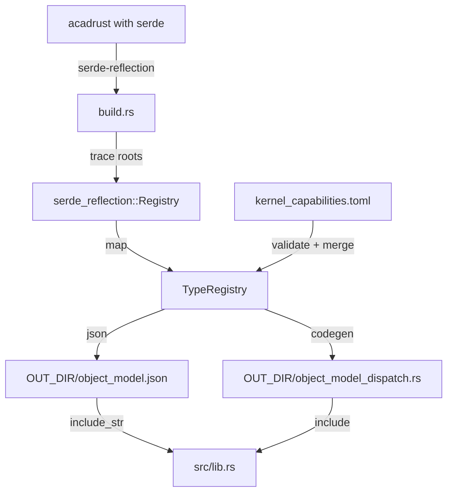

# ocs_doc_api Plan

## Goal

Create `crates/ocs_doc_api` in the `OpenCADStudio` workspace. It generates a stable, language-agnostic object model for `acadrust::CadDocument` and its first-level contents at build time, and exposes a transport-agnostic runtime document API (`DocApi`) that can run in-process or be wrapped for IPC.

The crate is self-contained under `/crates/ocs_doc_api`. Its core does **not** depend on `ocs_plugin_api`. An optional `ocs_doc_api_ipc` subcrate may depend on `ocs_plugin_api` for future IPC integration.

## Constraints and Decisions

| Decision | Choice |
|---|---|
| Object-model scope | Full `CadDocument` schema: header, tables, entities, objects, classes, shared types. |
| `serde(skip)` fields | Omitted; they are transient DWG state, not logical document data. |
| Runtime deps (default) | `serde` only. |
| `kernel` feature | Pulls `cadkernel` + `acadrust`; enables generated `KernelOps` dispatch. |
| `engine` feature | Pulls `kernel` + `serde_json`; enables `DocApi` + `InProcessDocApi`. |
| Capability mapping | Hand-written `kernel_capabilities.toml` for the first milestone. |
| Generated outputs | `object_model.json` (embedded), `object_model_dispatch.rs` (included under `kernel`), and Markdown API docs. |
| Schema | Independent from `ocs_plugin_api`, optimized for document modeling. |
| Structure | Core crate + `ocs_doc_api_ipc` subcrate. Future `kernel_op_macros` subcrate possible. |
| Transport | Agnostic core. First milestone uses a callback-based local client. Future work adds `ocs_plugin_api` IPC variants. |
| Wire format | Caller-decided; `ocs_doc_api_ipc` uses `bincode` by default. |
| Payload builders | Not generated. Runtime validation (`validate_entity_payload`) is provided instead. |
| IPC in first milestone | Callback-only to avoid modifying `ocs_plugin_api`. Real IPC is future work. |

## Crate Layout

```text
crates/ocs_doc_api/
├── Cargo.toml
├── build.rs
├── kernel_capabilities.toml
├── doc_api_ops.toml    # operation metadata for generated docs
├── src/
│   ├── lib.rs          # embedded JSON, dispatch include, public helpers
│   ├── schema.rs       # TypeRegistry, TypeInfo, Capability, etc.
│   ├── doc_api.rs      # DocOp, Receipt, DocApi trait, validation
│   ├── in_process.rs   # InProcessDocApi (engine)
│   ├── convert.rs      # acadrust <-> cadkernel helpers (kernel)
│   ├── kernel_ops.rs   # KernelOps trait (kernel)
│   └── bin/
│       └── generate_docs.rs  # dev binary to write docs to a path
└── ocs_doc_api_ipc/    # optional IPC adapter subcrate
    ├── Cargo.toml
    └── src/lib.rs      # LocalDocApiClient, encode/decode helpers
```

## Build Pipeline



1. Trace `CadDocument`, `HeaderVariables`, `EntityType`, `EntityCommon`, `ObjectType`, table entries, classes, notifications, and shared types.
2. Provide comprehensive enum samples for non-unit variants.
3. Map the `serde-reflection` registry to `ocs_doc_api::schema::TypeRegistry`.
4. Load and validate `kernel_capabilities.toml`; merge capabilities into the registry.
5. Generate Markdown docs:
   - `object_model_docs.md` from the registry and capabilities.
   - `doc_api_ops.md` from `doc_api_ops.toml`.
6. Write `object_model.json` and, under `kernel`, write `object_model_dispatch.rs`.

## Runtime API (engine feature)

Core types:

- `DocOp`: one document operation (CRUD, snapshot, kernel ops).
- `Receipt`: result of one `DocOp`.
- `DocApiError`: failure cases.
- `Handle(u64)`: public handle wrapper with conversions to/from `acadrust::types::Handle`.
- `EntityPayload { kind, data: serde_json::Value }`: serializable entity representation.
- `DocumentSnapshot { name, entities }`: lightweight document view.
- `DocApi` trait: `execute(&mut self, op) -> Result<Receipt, DocApiError>`.
- `DocApiExt`: typed convenience methods.
- `validate_entity_payload`: checks an `EntityPayload` against the generated registry.
- `InProcessDocApi`: wraps `acadrust::CadDocument` and implements `DocApi`.
- Embedded docs: `EMBEDDED_OBJECT_MODEL_DOCS_MD` and `EMBEDDED_DOC_API_OPS_MD` const strings.
- `generate_docs` binary: writes both Markdown files to a configurable output directory.

First milestone implemented operations:

- `CreateDocument`, `GetDocument`, `ListEntities`
- `CreateEntity`, `ReadEntity`, `UpdateEntity`, `DeleteEntity`
- `OffsetEntity`

Other variants return `DocApiError::NotImplemented`.

## Feature Flags

| Feature | Enables | Dependencies added |
|---|---|---|
| (none) | Object-model JSON, parsed registry, embedded Markdown docs, `validate_entity_payload`. | `serde` |
| `kernel` | Generated `KernelOps` impls on `acadrust` entity types. | `acadrust`, `cadkernel` |
| `engine` | `DocApi`, `InProcessDocApi`, `DocApiExt`. | `kernel` + `serde_json` |

## Task List

1. Create `crates/ocs_doc_api/Cargo.toml` with default, `kernel`, and `engine` features.
2. Add `crates/ocs_doc_api` and `crates/ocs_doc_api/ocs_doc_api_ipc` to root workspace members.
3. Implement `src/schema.rs`: `TypeId`, `TypeKind`, `FieldInfo`, `EnumVariantInfo`, `Capability`, `TypeInfo`, `TypeRegistry`.
4. Implement `build.rs`:
   - Set up `Tracer` + `Samples`.
   - Trace all roots.
   - Provide enum samples.
   - Map to `TypeRegistry`.
   - Load / validate / merge `kernel_capabilities.toml`.
   - Write `object_model.json`.
   - Under `kernel`, write `object_model_dispatch.rs`.
5. Create minimal `kernel_capabilities.toml` for the first milestone:
   - `to_planar_curve` for `Line` and `Circle`.
   - `offset` for `LwPolyline`.
   - Add further capabilities only when they have generated dispatch and tests.
6. Create `doc_api_ops.toml` describing first-milestone `DocOp` / `Receipt` variants (initial entries: `CreateDocument`, `GetDocument`, `ListEntities`, `CreateEntity`, `ReadEntity`, `UpdateEntity`, `DeleteEntity`, `OffsetEntity`).
7. Implement `src/lib.rs`: embed JSON and Markdown docs, include dispatch code, expose `object_model()`, `capabilities_for()`, `embedded_object_model_docs_md()`, and `embedded_doc_api_ops_md()`.
7. Implement `src/convert.rs` (`kernel`): `acadrust::Vector3` <-> `cadkernel::space::Vec3`.
8. Implement `src/kernel_ops.rs` (`kernel`): `KernelOps` trait and generated impls.
9. Implement `src/doc_api.rs` (`engine`): `DocOp`, `Receipt`, `DocApiError`, `Handle`, `EntityPayload`, `DocumentSnapshot`, `BoolOp`, `DocApi` trait, `DocApiExt`, `validate_entity_payload`.
10. Implement `src/in_process.rs` (`engine`): `InProcessDocApi` with CRUD, snapshot, and `OffsetEntity` support.
11. Implement `src/bin/generate_docs.rs`: read embedded docs and write them to a CLI-specified output directory.
12. Add core tests:
    - Parse embedded JSON.
    - Query capabilities.
    - Registry JSON round-trip.
    - Kernel dispatch: `to_planar_curve` returns `Some` for `Line`, `None` for `MText`.
    - `validate_entity_payload` rejects missing required field.
12. Create `ocs_doc_api_ipc` subcrate:
    - `LocalDocApiClient::new(tab_id: u64, dispatch: &mut dyn FnMut(u64, &[u8]) -> Vec<u8>)`.
    - `decode_op` / `encode_receipt` helpers.
    - Mock-host round-trip test.
    - (Future work) `IpcDocApiClient` over `ocs_plugin_api` IPC.
13. Add integration test: create a three-vertex `lwpolyline` and offset it by `0.5` in-process and through `LocalDocApiClient`.
14. Add documentation tests:
    - Embedded Markdown docs are non-empty.
    - `doc_api_ops.toml` variants match the `DocOp` enum variants (unit test).
    - `generate_docs` binary produces files at a user-specified path.
15. Run validation commands and fix `serde-reflection` tracing failures.

## Validation

- `cargo check -p ocs_doc_api` passes.
- `cargo check -p ocs_doc_api --features kernel` passes.
- `cargo check -p ocs_doc_api --features engine` passes.
- `cargo check -p ocs_doc_api_ipc` passes.
- `cargo test -p ocs_doc_api` passes.
- Embedded JSON is non-empty and parses into `TypeRegistry`.
- `capabilities_for("Line")` returns expected capabilities.
- In-process polyline create + offset test passes.
- Local callback round-trip test passes.
- `validate_entity_payload` rejects a payload missing a required field.
- Embedded Markdown docs are non-empty.
- `doc_api_ops.toml` matches the `DocOp` enum variants.
- `cargo run -p ocs_doc_api --bin generate_docs -- --out-dir <path>` writes `object_model_docs.md` and `doc_api_ops.md`.
- Core crate does not pull in `ocs_plugin_api`.

## Risks

| Risk | Mitigation |
|---|---|
| `serde-reflection` fails on `CadDocument` | Provide enum samples; ignore skipped fields. |
| Confusing `Table<T>` names in registry | Post-process names if needed. |
| `cadkernel` signatures change | Generated dispatch fails to compile; fix templates. |
| `kernel_capabilities.toml` becomes stale | Build-time validation panics on unknown type refs. |
| `acadrust::Handle` lacks public `u64` conversion | Implement conversion in host or adjust feature gating. |
| Brittle JSON payloads | `validate_entity_payload` catches shape errors early. |
| Operation docs drift from `DocOp` enum | Unit test validates `doc_api_ops.toml` against the enum. |
| Real IPC delayed | Document callback path; future work adds `DocApiRequest` / `DocApiResponse`. |

## Out of Scope

- Replacing `ocs_plugin_api`.
- UI, selection, command-state, render-cache modeling.
- Language bindings generated from JSON.
- Proc-macro capability discovery in first milestone.
- Real `ocs_plugin_api` IPC in first milestone.
- Typed entity payload builders.
- Full file I/O in `InProcessDocApi`; `OpenDocument`/`SaveDocument` return `NotImplemented`.
- Every `DocOp` variant in first milestone; focus on CRUD, snapshot, offset.
- HTML documentation rendering; first milestone produces Markdown only.

---

## Appendix A: Documentation Output

The build script writes these Markdown files to `OUT_DIR`:

- `object_model_docs.md` — every type in the registry, its fields, enum variants, and attached kernel capabilities.
- `doc_api_ops.md` — every `DocOp` and `Receipt` variant described in `doc_api_ops.toml`.

Both are embedded as const strings:

```rust
pub const EMBEDDED_OBJECT_MODEL_DOCS_MD: &str =
    include_str!(concat!(env!("OUT_DIR"), "/object_model_docs.md"));

pub const EMBEDDED_DOC_API_OPS_MD: &str =
    include_str!(concat!(env!("OUT_DIR"), "/doc_api_ops.md"));
```

A dev binary writes the same files to a configurable directory:

```bash
cargo run -p ocs_doc_api --bin generate_docs -- --out-dir docs/api
```

## Appendix B: `doc_api_ops.toml` Example

```toml
[[operation]]
variant = "CreateDocument"
doc = "Create a new, empty document with the given name."
receipt = "DocumentCreated"

[[operation]]
variant = "CreateEntity"
doc = "Create an entity from an EntityPayload. Returns the new handle."
receipt = "EntityCreated"

[[operation]]
variant = "OffsetEntity"
doc = "Offset an entity by the given distance. Currently supported for LwPolyline."
receipt = "OffsetResult"
```

A unit test parses this file and asserts that every `variant` matches a variant of the Rust `DocOp` enum, and every `receipt` matches a variant of `Receipt`.

## Appendix C: Schema Types

```rust
use serde::{Deserialize, Serialize};
use std::collections::BTreeMap;

#[derive(Debug, Clone, PartialEq, Eq, PartialOrd, Ord, Hash, Serialize, Deserialize)]
pub struct TypeId(String);

impl TypeId {
    pub fn new(s: impl Into<String>) -> Self { Self(s.into()) }
    pub fn as_str(&self) -> &str { &self.0 }
}

#[derive(Debug, Clone, Copy, PartialEq, Eq, Serialize, Deserialize)]
pub enum TypeKind { Struct, Enum, Newtype, Tuple, Unit }

#[derive(Debug, Clone, Serialize, Deserialize)]
pub struct FieldInfo {
    pub name: String,
    pub type_id: TypeId,
    pub optional: bool,
    pub is_sequence: bool,
}

#[derive(Debug, Clone, Serialize, Deserialize)]
pub struct EnumVariantInfo {
    pub name: String,
    pub discriminant: u32,
    pub fields: Vec<FieldInfo>,
}

#[derive(Debug, Clone, Serialize, Deserialize)]
pub struct Capability {
    pub name: String,
    pub module: String,
    pub input: TypeId,
    pub output: Option<TypeId>,
    pub parameters: Vec<FieldInfo>,
}

#[derive(Debug, Clone, Serialize, Deserialize)]
pub struct TypeInfo {
    pub name: TypeId,
    pub kind: TypeKind,
    pub fields: Vec<FieldInfo>,
    pub variants: Vec<EnumVariantInfo>,
    pub capabilities: Vec<Capability>,
    pub doc: Option<String>,
}

#[derive(Debug, Clone, Default, Serialize, Deserialize)]
pub struct TypeRegistry {
    pub types: BTreeMap<TypeId, TypeInfo>,
}
```

## Appendix D: Runtime API Types

```rust
use serde::{Deserialize, Serialize};

#[derive(Debug, Clone, Copy, PartialEq, Eq, Hash, Serialize, Deserialize)]
pub struct Handle(pub u64);

#[derive(Debug, Clone, Serialize, Deserialize)]
pub enum DocOp {
    CreateDocument { name: String },
    OpenDocument { path: String },
    SaveDocument { path: String },
    CloseDocument,
    GetDocument,
    SetDocument { snapshot: DocumentSnapshot },
    CreateEntity { payload: EntityPayload },
    ReadEntity { handle: Handle },
    UpdateEntity { handle: Handle, payload: EntityPayload },
    DeleteEntity { handles: Vec<Handle> },
    ListEntities,
    OffsetEntity { handle: Handle, distance: f64 },
    CurveLength { handle: Handle },
    CurveArea { handle: Handle },
    SolidVolume { handle: Handle },
    Boolean { op: BoolOp, target: Handle, tool: Handle },
}

#[derive(Debug, Clone, Serialize, Deserialize)]
pub enum Receipt {
    Ok,
    DocumentCreated,
    DocumentOpened,
    DocumentSaved,
    DocumentClosed,
    Snapshot { snapshot: DocumentSnapshot },
    EntityCreated { handle: Handle },
    Entity { payload: EntityPayload },
    EntityList { handles: Vec<Handle> },
    Length(f64),
    Area(f64),
    Volume(f64),
    OffsetResult { handles: Vec<Handle> },
}

#[derive(Debug, Clone, Serialize, Deserialize)]
pub struct DocumentSnapshot {
    pub name: String,
    pub entities: Vec<(Handle, EntityPayload)>,
}

#[derive(Debug, Clone, Serialize, Deserialize)]
pub struct EntityPayload {
    pub kind: String,
    pub data: serde_json::Value,
}

#[derive(Debug, Clone, Copy, Serialize, Deserialize)]
pub enum BoolOp { Union, Difference, Intersection }

#[derive(Debug, Clone, Serialize, Deserialize)]
pub enum DocApiError {
    NotFound,
    InvalidPayload(String),
    KernelError(String),
    NotImplemented,
    Io(String),
    Serialize(String),
    Deserialize(String),
    Other(String),
}

pub trait DocApi {
    fn execute(&mut self, op: DocOp) -> Result<Receipt, DocApiError>;
}

pub trait DocApiExt: DocApi {
    fn create_entity(&mut self, payload: EntityPayload) -> Result<Handle, DocApiError> { ... }
    fn read_entity(&mut self, handle: Handle) -> Result<EntityPayload, DocApiError> { ... }
    fn update_entity(&mut self, handle: Handle, payload: EntityPayload) -> Result<(), DocApiError> { ... }
    fn delete_entity(&mut self, handles: &[Handle]) -> Result<(), DocApiError> { ... }
    fn list_entities(&mut self) -> Result<Vec<Handle>, DocApiError> { ... }
    fn get_document(&mut self) -> Result<DocumentSnapshot, DocApiError> { ... }
    fn set_document(&mut self, snapshot: DocumentSnapshot) -> Result<(), DocApiError> { ... }
    fn offset_entity(&mut self, handle: Handle, distance: f64) -> Result<Vec<Handle>, DocApiError> { ... }
}
impl<T: DocApi + ?Sized> DocApiExt for T {}
```

## Appendix E: Cargo.toml

```toml
[package]
name = "ocs_doc_api"
version = "0.1.0"
edition = "2021"
description = "Build-time generated object model and transport-agnostic document API"

[dependencies]
serde = { version = "1", features = ["derive"] }

# kernel feature
cadkernel = { git = "https://github.com/HakanSeven12/cadkernel.git", rev = "0507b720fef47bd7da0d4f777f97f1743a4f4038", features = ["acis", "offset"], optional = true }
acadrust = { git = "https://github.com/HakanSeven12/cadcodec.git", rev = "f23ffc873228e5f41b876485c741e4a8ac20a67d", features = ["serde"], optional = true }

# engine feature
serde_json = { version = "1", optional = true }

[features]
default = []
kernel = ["dep:cadkernel", "dep:acadrust"]
engine = ["kernel", "dep:serde_json"]

[[bin]]
name = "generate_docs"
path = "src/bin/generate_docs.rs"
required-features = ["engine"]

[build-dependencies]
serde-reflection = "0.6"
serde_json = "1"
serde = { version = "1", features = ["derive"] }
toml = "0.8"
acadrust = { git = "https://github.com/HakanSeven12/cadcodec.git", rev = "f23ffc873228e5f41b876485c741e4a8ac20a67d", features = ["serde"] }
```

## Appendix F: Plugin Example

```rust
use ocs_doc_api::{DocApi, DocApiExt, EntityPayload, Handle};
use ocs_doc_api_ipc::LocalDocApiClient;
use serde_json::json;

pub fn run<F>(mut dispatch: F) -> Result<(), String>
where
    F: FnMut(u64, &[u8]) -> Vec<u8>,
{
    let mut api = LocalDocApiClient::new(0, &mut dispatch);

    let payload = EntityPayload {
        kind: "lwpolyline".into(),
        data: json!({
            "vertices": [
                { "x": 0.0, "y": 0.0, "bulge": 0.0 },
                { "x": 10.0, "y": 0.0, "bulge": 0.0 },
                { "x": 5.0, "y": 5.0, "bulge": 0.0 },
            ],
            "closed": false,
        }),
    };

    ocs_doc_api::validate_entity_payload(&payload)
        .map_err(|e| format!("payload validation failed: {}", e))?;

    let handle: Handle = api.create_entity(payload)
        .map_err(|e| format!("create_entity failed: {:?}", e))?;

    let offsets: Vec<Handle> = api.offset_entity(handle, 0.5)
        .map_err(|e| format!("offset_entity failed: {:?}", e))?;

    println!("Created lwpolyline at handle {}, got {} offset result(s)",
        handle.0, offsets.len());

    Ok(())
}
```

## Appendix G: Future Work

### G.1 Proc-macro capability discovery

Replace `kernel_capabilities.toml` with a proc macro that annotates real `cadkernel` functions. This makes the source of truth the actual function signatures and lets the compiler validate them. The proc macro lives in a new `kernel_op_macros` subcrate and is consumed by both `cadkernel` (to declare capabilities) and `ocs_doc_api/build.rs` (to discover them at build time).

#### New subcrate layout

```text
crates/ocs_doc_api/kernel_op_macros/
├── Cargo.toml
└── src/lib.rs
```

`kernel_op_macros/Cargo.toml`:

```toml
[package]
name = "kernel_op_macros"
version = "0.1.0"
edition = "2021"

[lib]
proc-macro = true

[dependencies]
proc-macro2 = "1"
quote = "1"
syn = { version = "2", features = ["full"] }
```

#### Annotated cadkernel functions (future cadkernel change)

The macro annotates free functions whose first argument is a reference to an `acadrust` entity. The attribute names the entity, the capability, and any constraints the dispatcher must satisfy.

```rust
use kernel_op_macros::kernel_op;

#[kernel_op(
    entity = "acadrust::entities::Line",
    capability = "to_planar_curve",
    output = "Option<cadkernel::space::PlanarCurve>"
)]
pub fn line_to_planar_curve(line: &acadrust::entities::Line) -> Option<cadkernel::space::PlanarCurve> {
    Some(cadkernel::geom2d::Curve::Line(cadkernel::geom2d::Line {
        start: vec3(line.start),
        end: vec3(line.end),
    }).into())
}

#[kernel_op(
    entity = "acadrust::entities::Circle",
    capability = "to_planar_curve",
    output = "Option<cadkernel::space::PlanarCurve>"
)]
pub fn circle_to_planar_curve(circle: &acadrust::entities::Circle) -> Option<cadkernel::space::PlanarCurve> {
    Some(cadkernel::geom2d::Curve::Circle(cadkernel::geom2d::Circle {
        center: vec3(circle.center),
        radius: circle.radius,
    }).into())
}

#[kernel_op(
    entity = "acadrust::entities::LwPolyline",
    capability = "offset",
    output = "Vec<cadkernel::space::LwPolyline>",
    requires = "planar, non-self-intersecting"
)]
pub fn offset_lwpolyline(
    polyline: &acadrust::entities::LwPolyline,
    distance: f64,
) -> Vec<cadkernel::space::LwPolyline> {
    // cadkernel implementation
}
```

#### Macro implementation sketch

`kernel_op_macros/src/lib.rs` parses the attribute, validates the signature, and emits a hidden metadata constant alongside the original function. The constant is discoverable by a source scan in `ocs_doc_api/build.rs`.

```rust
use proc_macro::TokenStream;
use quote::quote;
use syn::{parse_macro_input, AttributeArgs, FnArg, ItemFn, PatType, Type};

#[proc_macro_attribute]
pub fn kernel_op(args: TokenStream, input: TokenStream) -> TokenStream {
    let args = parse_macro_input!(args as AttributeArgs);
    let item = parse_macro_input!(input as ItemFn);

    let entity = parse_entity(&args);
    let capability = parse_capability(&args);
    let output = parse_output(&args);
    let requires = parse_requires(&args);

    // Validate first argument is &AcadEntity.
    let first_arg = item.sig.inputs.first().expect("kernel_op needs at least one argument");
    validate_entity_arg(first_arg, &entity);

    let fn_name = &item.sig.ident;
    let meta_name = quote::format_ident!("_KERNEL_OP_META_{}", fn_name);

    let expanded = quote! {
        #item

        #[doc(hidden)]
        #[allow(non_upper_case_globals)]
        pub const #meta_name: ::kernel_op_macros::KernelOpMeta = ::kernel_op_macros::KernelOpMeta {
            entity: #entity,
            capability: #capability,
            function_path: module_path!(),
            function_name: stringify!(#fn_name),
            output: #output,
            requires: #requires,
        };
    };

    expanded.into()
}
```

The macro crate also exposes a small `KernelOpMeta` struct so annotated crates can reference it without depending on `ocs_doc_api`:

```rust
// kernel_op_macros/src/lib.rs (non-proc-macro re-export)
pub struct KernelOpMeta {
    pub entity: &'static str,
    pub capability: &'static str,
    pub function_path: &'static str,
    pub function_name: &'static str,
    pub output: &'static str,
    pub requires: &'static str,
}
```

#### Build-time discovery in `ocs_doc_api/build.rs`

Instead of reading `kernel_capabilities.toml`, the build script scans the `cadkernel` source tree for `#[kernel_op(...)]` attributes and produces the same registry entries.

```rust
use std::path::PathBuf;
use syn::{Attribute, ItemFn};

fn discover_kernel_ops(cadkernel_dir: &PathBuf) -> Vec<KernelOpMeta> {
    let mut ops = Vec::new();
    for entry in walkdir::WalkDir::new(cadkernel_dir)
        .into_iter()
        .filter_map(|e| e.ok())
        .filter(|e| e.path().extension().map(|x| x == "rs").unwrap_or(false))
    {
        let src = std::fs::read_to_string(entry.path()).unwrap();
        let file = syn::parse_file(&src).unwrap();
        for item in file.items {
            if let syn::Item::Fn(f) = item {
                if let Some(attr) = find_kernel_op_attr(&f.attrs) {
                    ops.push(parse_kernel_op_attr(attr, &f));
                }
            }
        }
    }
    ops
}
```

The scanner is only enabled when `ocs_doc_api` is built with the `kernel` feature and a path to `cadkernel` is available. It validates every reference:

- The entity string exists in the generated `TypeRegistry`.
- The capability name matches a known `KernelOp` variant.
- The output type string is resolvable in the generated dispatch code.

If any reference is invalid, the build fails immediately with a clear span-free error (the source file path and line are reported from `walkdir`).

#### Merging hand-written overrides

During migration the macro can coexist with `kernel_capabilities.toml`. The build script loads macro-discovered ops first, then applies TOML overrides. This lets kernel engineers add new ops via annotations while preserving emergency manual entries.

```rust
let mut capabilities = discover_kernel_ops(&cadkernel_dir);
if let Ok(overrides) = load_kernel_capabilities_toml() {
    capabilities.merge(overrides);
}
```

#### Capability registration flow

```text
cadkernel/src/entities/line.rs
    #[kernel_op(entity="...Line", capability="to_planar_curve")]
    pub fn line_to_planar_curve(...) -> ...
              |
              v
    syn source scan in ocs_doc_api/build.rs
              |
              v
    Vec<KernelOpMeta>  -->  TypeRegistry capabilities
              |
              v
    object_model.json  +  object_model_dispatch.rs
```

#### Migration checklist from `kernel_capabilities.toml`

1. Add `kernel_op_macros` subcrate and annotate existing `cadkernel` functions.
2. Update `ocs_doc_api/build.rs` to scan `cadkernel` source and merge TOML overrides.
3. Keep `kernel_capabilities.toml` as an empty override file for one release.
4. Remove the TOML file once all capabilities are annotated and validated in CI.

### G.2 Real IPC through `ocs_plugin_api`

Extend `ocs_plugin_api` with dedicated document-API request/response variants and a vtable method on `HostApi`. Then replace `LocalDocApiClient` with `IpcDocApiClient`.

#### `ocs_plugin_api` enum additions

```rust
pub enum PluginRequest {
    // ... existing variants ...
    DocApiRequest {
        tab_id: TabId,
        bytes: Vec<u8>,
    },
}

pub enum PluginResponse {
    // ... existing variants ...
    DocApiResponse {
        bytes: Vec<u8>,
    },
}
```

#### `HostApi` vtable addition

```rust
pub trait HostApi {
    // ... existing methods ...
    fn doc_api_dispatch(&self, tab_id: TabId, bytes: Vec<u8>) -> Vec<u8>;
}
```

#### `ocs_doc_api_ipc` future client

```rust
use ocs_doc_api::{DocApi, DocApiError, DocOp, Receipt};
use ocs_plugin_api::{HostApi, TabId};

pub struct IpcDocApiClient<'a> {
    host: &'a dyn HostApi,
    tab_id: TabId,
}

impl<'a> IpcDocApiClient<'a> {
    pub fn new(host: &'a dyn HostApi, tab_id: TabId) -> Self {
        Self { host, tab_id }
    }
}

impl DocApi for IpcDocApiClient<'_> {
    fn execute(&mut self, op: DocOp) -> Result<Receipt, DocApiError> {
        let bytes = bincode::serialize(&op)
            .map_err(|e| DocApiError::Serialize(e.to_string()))?;
        let response = self.host.doc_api_dispatch(self.tab_id, bytes);
        bincode::deserialize(&response)
            .map_err(|e| DocApiError::Deserialize(e.to_string()))
    }
}
```

#### Host-side wiring (OpenCADStudio)

```rust
use ocs_doc_api::DocApi;
use ocs_doc_api_ipc::{decode_op, encode_receipt};

fn host_doc_api_dispatch(
    app: &mut App,
    tab_id: TabId,
    bytes: Vec<u8>,
) -> Vec<u8> {
    let op = match decode_op(&bytes) {
        Ok(op) => op,
        Err(e) => return encode_receipt(Err(e)),
    };
    let mut api = app.tab_mut(tab_id).in_process_doc_api();
    encode_receipt(api.execute(op))
}
```

This also requires bumping `API_VERSION` in `ocs_plugin_api` because the vtable gains a new method.

### G.3 Typed payload builders

Once the entity schema is stable, generate lightweight payload structs so plugins do not write raw `serde_json::Value`.

#### Generated example

```rust
pub struct LwPolylinePayload {
    pub vertices: Vec<LwVertexPayload>,
    pub closed: bool,
}

pub struct LwVertexPayload {
    pub x: f64,
    pub y: f64,
    pub bulge: f64,
}

impl LwPolylinePayload {
    pub fn into_entity_payload(self) -> ocs_doc_api::EntityPayload {
        ocs_doc_api::EntityPayload {
            kind: "lwpolyline".into(),
            data: serde_json::to_value(self).unwrap(),
        }
    }
}
```

These can be generated by `ocs_doc_api/build.rs` from the `TypeRegistry`, or written by hand once the schema settles. Auto-generation is future work because it requires field-to-field mapping for every first-level entity type.

### G.4 Language bindings

The embedded `object_model.json` is language-agnostic. Future work can consume it from other languages:

- **Python**: generate dataclasses from `TypeRegistry`.
- **C# / TypeScript**: generate classes / interfaces.
- **JSON Schema**: convert the registry to a standard JSON Schema for validation.

Example Python generator sketch:

```python
import json
from pathlib import Path

registry = json.loads(Path("object_model.json").read_text())

for name, info in registry["types"].items():
    if info["kind"] == "Struct":
        fields = [f"    {f['name']}: {map_type(f['type_id'])}" for f in info["fields"]]
        print(f"@dataclass\nclass {name}:\n" + "\n".join(fields))
```

Bindings live in separate repositories or generator scripts; they are not part of the Rust crate itself.

### G.5 HTML documentation rendering

The first milestone produces Markdown. Future work can render the same content as HTML using a lightweight static-site generator or by emitting rustdoc-friendly modules. A possible path:

1. `generate_docs` binary gains `--format html --out-dir docs/api`.
2. It uses the embedded Markdown plus a small template to produce an index page and per-type pages.
3. CI publishes the rendered docs alongside crate releases.
